<h1 align=center> React Native Group Chat </h1>

<p align="center">


</p>

This is a single group chat application where one can chat with all the members having the application.
It is implemented using firebase realtime database.

<h2> Screenshots: </h2>

<table align="center">
  <tr>
    <td> 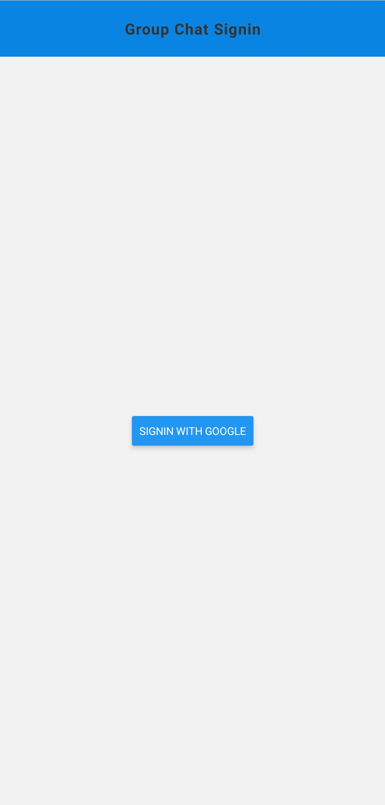 </td>
    <td> 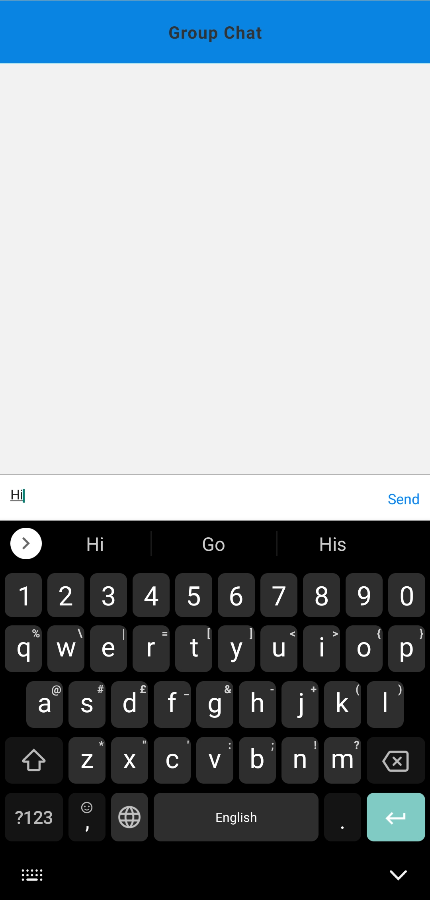 </td>
    <td> 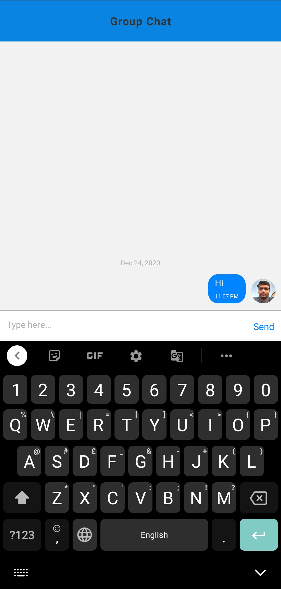 </td>
  </tr>
</table>

<br>
<h1> Setup: </h1>

1. [Create a GCP project](#1-create-a-gcp-project)
2. [Create OAuth client id for google signin](#2-create-oauth-client-id-for-google-signin)
3. [Add Firebase to this project](#3-add-firebase-to-this-project)
4. [Create a web app in firebase](#4-create-a-web-app-in-firebase)
5. [Create a realtime database and edit the rules](#5-create-a-realtime-database-and-edit-the-rules)
6. [Clone this repo](#6-clone-this-repo)
7. [Make changes to credentials.js](#7-make-changes-to-credentialsjs)
8. [Run the application](#8-run-the-application)


### 1. Create a GCP project:

Go to [GCP console](https://console.cloud.google.com/) and create a new project.
<p align="center">
  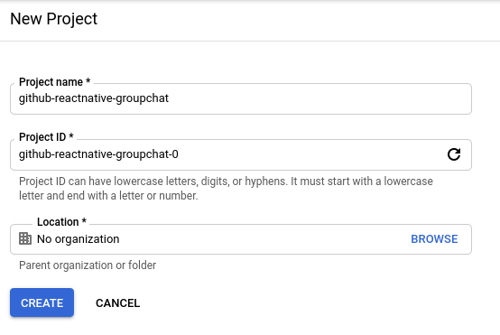
</p>


### 2. Create OAuth client id for google signin:

Now go to API & Services and then add an OAuth consent screen, select user type as External and add some app name and email.
Hit save and continue and then go to credentials tab.
<p align="center">
  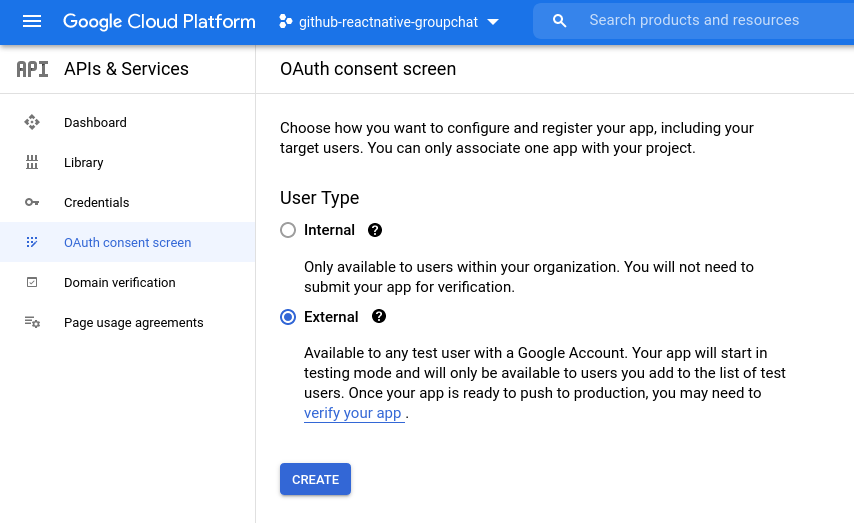
</p>

Create a OAuth client ID credential and fill the details.
<p align="center">
  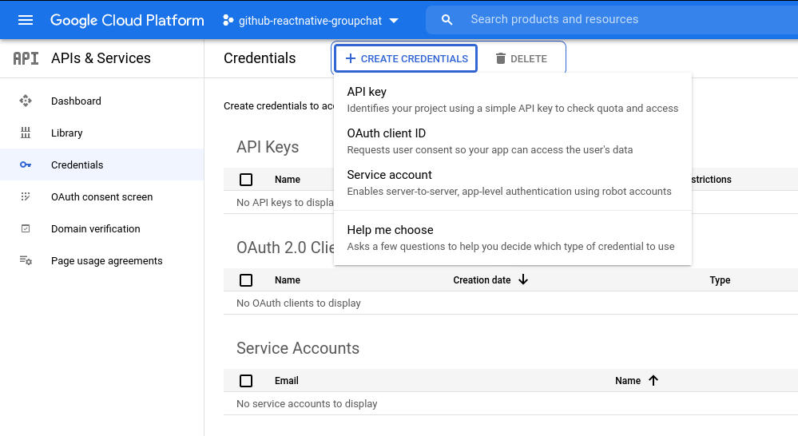
</p>

<p align="center">
  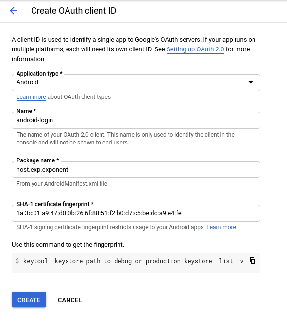
</p>

SHA-1 ceritficate fingerprint is random and is generated using 
```sh
$ openssl rand -base64 32 | openssl sha1 -c
```


### 3. Add Firebase to this project:

Go to [Firebase console](https://console.firebase.google.com/) and add firebase to the same gcp project.
<p align="center">
  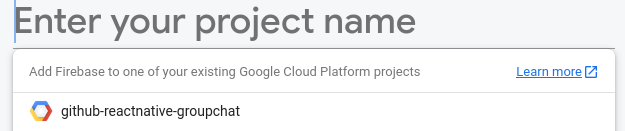
</p>

<p align="center">
  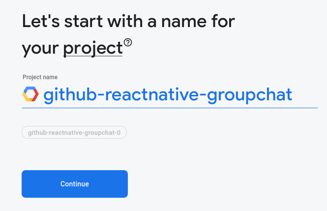
</p>


### 4. Create a web app in firebase:
Go to project settings, in general tab, create a web app.
<p align="center">
  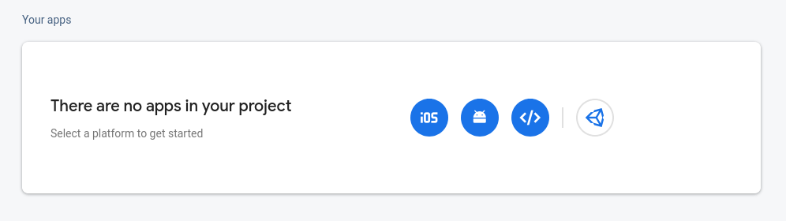
</p>
<p align="center">
  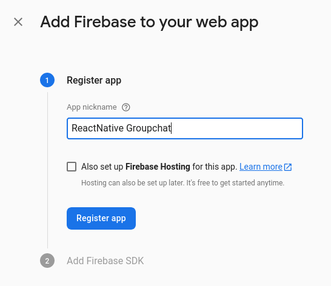
</p>

Give it some name and copy the **firebaseConfig** object.
<p align="center">
  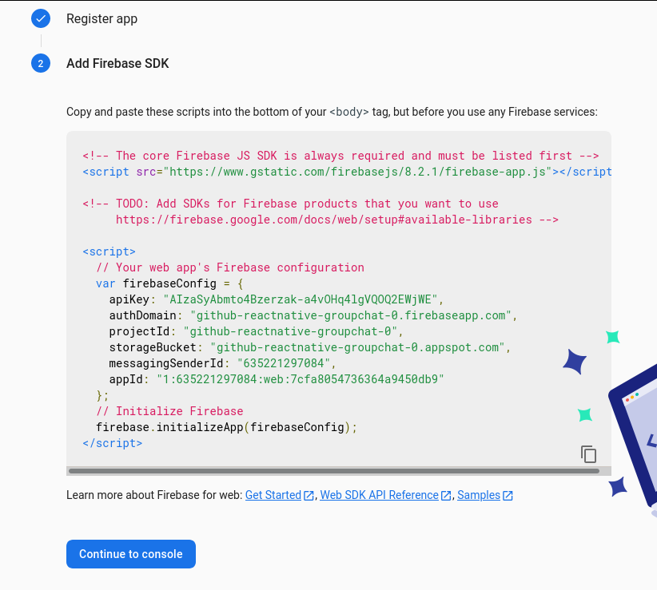
</p>

Make sure your webapp is created.
<p align="center">
  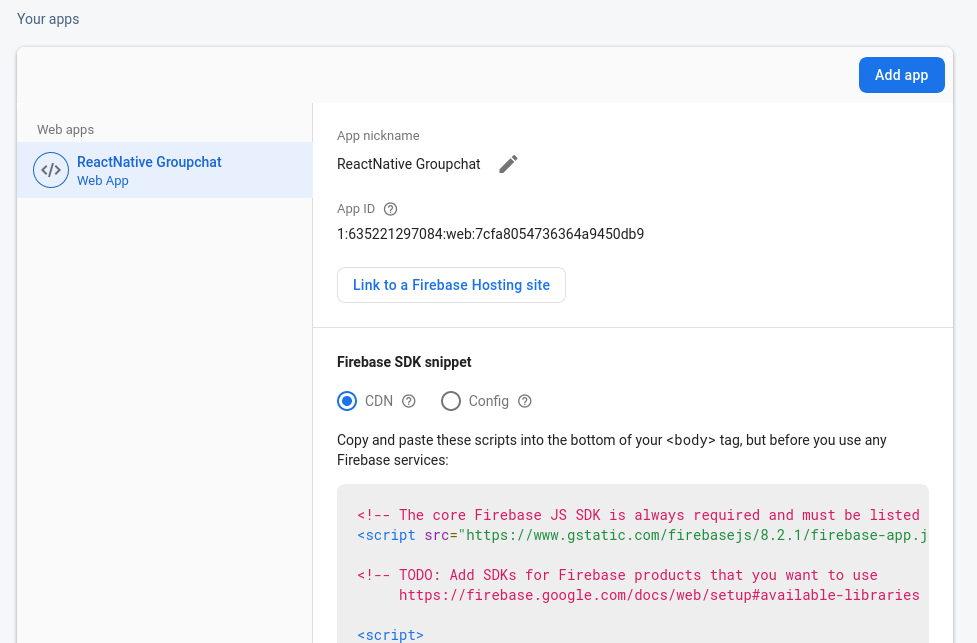
</p>


### 5. Create a realtime database and edit the rules:
Go to realtime database tab and create it.
<p align="center">
  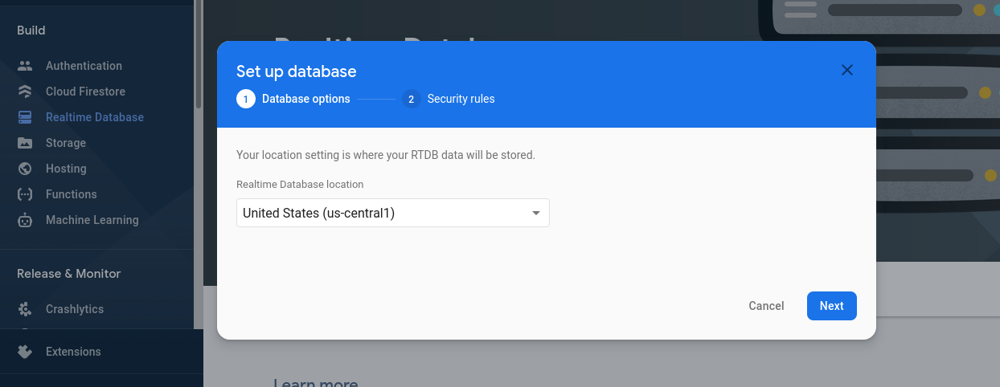
</p>

<p align="center">
  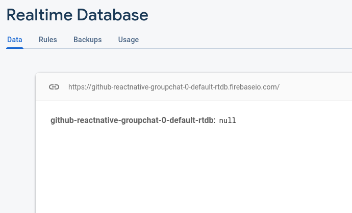
</p>

Edit the rules as follows:
<p align="center">
  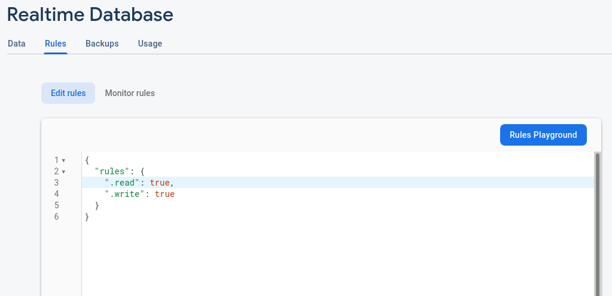
</p>


### 6. Clone this repo:
Clone repo and install npm packages.

```sh
$ git clone https://github.com/Sanket-Valani/react-native-group-chat.git
$ cd react-native-group-chat
$ npm install
```


### 7. Make changes to credentials.js:
Edit this [credentials.js](https://github.com/Sanket-Valani/react-native-group-chat/blob/master/credentials.js) file
The **CLIENT_ID** is the OAuth API key which will be create after [Step 2](#2-create-oauth-client-id-for-google-signin) 
and the **firebase_js** is the **firebaseConfig** object in [Step 4](#4-create-a-web-app-in-firebase).

### 8. Run the application:
Connect your phone and laptop/pc to a common wifi network and then run
```sh
$ npm start
```
App will get listed in the [Expo client](https://play.google.com/store/apps/details?id=host.exp.exponent).

<br>

### Note:
This app will run properly on an Expo client only. To run it on a standalone app please refer 
[this](https://docs.expo.io/versions/v40.0.0/sdk/google/#deploying-to-a-standalone-app-on-android).